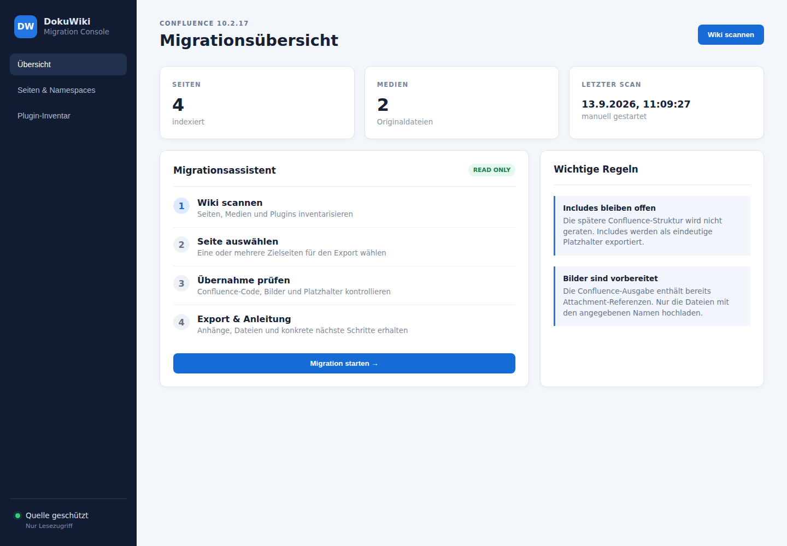
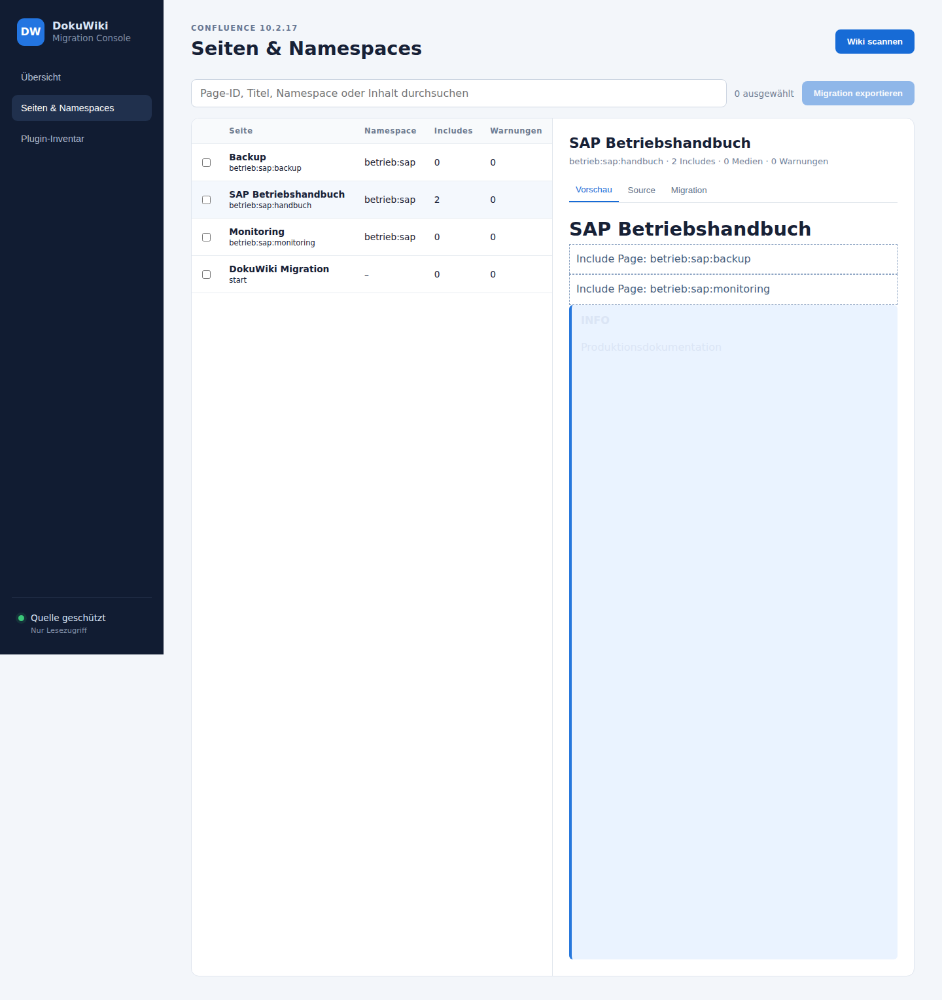
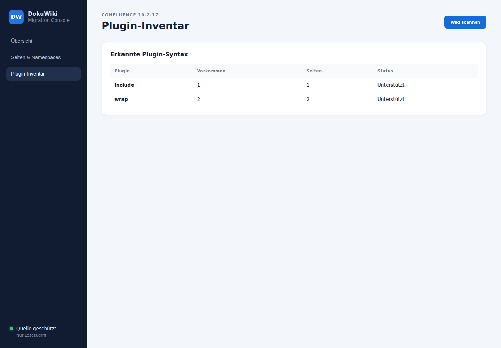

# DokuWiki Confluence Migrator

[](https://github.com/TimUx/Doku-Wiki-Confluence_migration/actions/workflows/ci.yml)
[](https://github.com/TimUx/Doku-Wiki-Confluence_migration/actions/workflows/security.yml)
[](https://github.com/TimUx/Doku-Wiki-Confluence_migration/actions/workflows/screenshots.yml)

Eigenständig laufende Go-Webanwendung zur read-only Analyse eines DokuWiki und zur Vorbereitung einer manuellen Migration nach Confluence 10.2.17. Die Weboberfläche, HTTP-API, SQLite-Datenbank, Parser und Exportlogik laufen in einer einzelnen Binary.

## Funktionsumfang

- Read-only Dateisystemscan für Seiten und Originalmedien
- strukturiertes internes Dokumentmodell statt direkter Regex-Konvertierung
- Erkennung von internen/externalen Links, Medien, Includes, WRAP-Boxen und unbekannten Plugins
- SQLite-Index, Suche, Plugin-Inventar, Preview und Dependency-Anzeige
- ZIP-Export mit HTML, Markdown, Originalquelle, Metadaten, Medien, Manifest und Report
- Schutz gegen manipulierte IDs, Path Traversal, Symlink Escapes, XSS und ZIP Slip
- kontrolliertes Herunterfahren bei `SIGINT` und `SIGTERM`

## Architektur

`cmd/migrator` startet Konfiguration, SQLite und HTTP-Server. `internal/scanner` liest ausschließlich die konfigurierten Quellpfade. `internal/parser` erzeugt das neutrale Modell aus `internal/model`. Renderer und Export arbeiten ausschließlich auf diesem Modell. Details stehen in [docs/architecture.md](docs/architecture.md).

## Voraussetzungen und Build

Go 1.26.8 oder neuer wird nur zum Bauen benötigt. Die fertige Binary benötigt weder Go, Node.js noch einen externen Web- oder Datenbankserver. Node.js und Chromium werden ausschließlich vom Screenshot-Workflow verwendet.

```bash
go mod download
go test ./...
make release
```

Linux AMD64:

```bash
CGO_ENABLED=0 GOOS=linux GOARCH=amd64 go build -trimpath -ldflags="-s -w" -o dist/dokuwiki-confluence-migrator-linux-amd64 ./cmd/migrator
```

## Installation und Start

```bash
install -m 0755 dist/dokuwiki-confluence-migrator-linux-amd64 /opt/dokuwiki-confluence-migrator/dokuwiki-confluence-migrator
install -m 0640 config.example.yaml /etc/dokuwiki-confluence-migrator/config.yaml
/opt/dokuwiki-confluence-migrator/dokuwiki-confluence-migrator --config /etc/dokuwiki-confluence-migrator/config.yaml
```

Die Oberfläche ist danach standardmäßig auf Port 8080 verfügbar. Vor dem Start kann die Konfiguration mit `check-config --config …` geprüft werden. Eine systemd-Vorlage liegt unter `packaging/`.

## Konfiguration

Kopiere `config.example.yaml` nach `config.yaml` und passe die absoluten DokuWiki- und Arbeitsverzeichnisse an. `security.read_only_source` muss `true` sein. Alle Schreibzugriffe erfolgen ausschließlich unter den Storage-Pfaden.

## Arbeitsablauf

1. „Wiki scannen“ aktualisiert den SQLite-Index.
2. Seiten lassen sich nach ID, Titel, Namespace oder Inhalt suchen.
3. Vorschau, Source, Includes, Medien, Plugins und Warnungen werden geprüft.
4. Ausgewählte Seiten werden inklusive Include-Abhängigkeiten und Originalmedien als ZIP exportiert.
5. HTML/Markdown und Attachments werden kontrolliert in Confluence übernommen; der Status wird anhand des Reports nachvollzogen.

## DokuWiki-Struktur

`pages_path` zeigt auf `data/pages`, `media_path` auf `data/media`. `betrieb/sap/backup.txt` wird als `betrieb:sap:backup` indexiert. Relative Links und Medien werden gegen den Namespace der Quellseite aufgelöst.

## Plugin-Unterstützung

`include` und `WRAP` (`info`, `warning`, `note`, `tip`) sind unterstützt. Unbekannte XML-artige Plugin-Syntax bleibt im Modell erhalten, erscheint deutlich in der Vorschau und erzeugt eine Warnung. Handler lassen sich als nächste Ausbaustufe hinter einer zentralen Registry ergänzen.

## Exportformat

Jede Seite enthält `page.html`, `page.md`, `source.txt`, `metadata.json` und `attachments/`. Zusätzlich enthält das ZIP `manifest.json` sowie Reports in HTML und JSON. Absolute Serverpfade werden nicht als ZIP-Eintragsnamen verwendet.

## Sicherheit und Backup

Die Anwendung ist kein Ersatz für ein DokuWiki-Backup. Vor dem ersten Produktivscan wird ein reguläres Backup empfohlen. Der systemd-Dienst bindet das Quell-Wiki read-only ein und erlaubt Schreibzugriff nur auf das Arbeitsverzeichnis. Vollständige Dokumentinhalte werden nicht geloggt.

## Troubleshooting

- `pages_path does not exist`: absoluten Pfad und Rechte des Service-Users prüfen.
- Leere Oberfläche: Scan auslösen und Browser-Konsole bzw. Service-Log prüfen.
- Fehlendes Medium: Media-ID, Namespace und Groß-/Kleinschreibung im Quell-Wiki prüfen.
- SQLite gesperrt: nur eine Prozessinstanz auf derselben Datenbank betreiben.

## Bekannte Grenzen

- DokuWiki-Plugins sind installationsspezifisch; unbekannte Syntax wird bewusst nicht automatisch interpretiert.
- Confluence-Importmöglichkeiten und aktivierte Makros hängen von Edition, Konfiguration und Berechtigungen ab. Vor der Serienmigration ist ein Pilotimport nötig.
- Der HTML-Export ist als Copy/Paste-/Assistenzformat gedacht, nicht als Confluence-Space-Backup.

## Entwicklung und Tests

`testdata/dokuwiki` enthält ein kleines Test-Wiki. Lokal führt `make check` `go vet` und Tests mit Race Detector und Coverage aus. Mit `make fmt` lässt sich der Quellcode formatieren. Parser-, Security- und Integrationsfälle können dort erweitert werden.

## GitHub und Releases

- `.github/workflows/ci.yml` prüft jeden Push und Pull Request.
- `.github/workflows/security.yml` prüft Go-Abhängigkeiten mit `govulncheck`.
- `.github/workflows/screenshots.yml` startet eine Testinstanz, prüft die UI mit Chromium und aktualisiert die Dokumentationsbilder.
- `.github/workflows/release.yml` baut Linux-Artefakte und SHA-256-Prüfsummen für Tags wie `v0.1.0`.
- Dependabot schlägt Aktualisierungen für Go-Module und GitHub Actions vor.

Nach dem ersten Push sollte unter **Settings → Branches** ein Schutz für `main` aktiviert werden, der den Statuscheck `Test, Vet & Build` voraussetzt. Modulpfad, interne Imports, Badges und Repository-Links sind bereits auf `github.com/TimUx/Doku-Wiki-Confluence_migration` eingestellt.

Weitere Hinweise stehen in [CONTRIBUTING.md](CONTRIBUTING.md) und [SECURITY.md](SECURITY.md).

## Screenshots

Die folgenden Bilder werden vom GitHub-Workflow mit dem fiktiven Wiki unter `testdata/dokuwiki` erzeugt. Details zum Ablauf stehen in [docs/ui.md](docs/ui.md).

### Migrationsübersicht



### Seitendetail



### Plugin-Inventar


