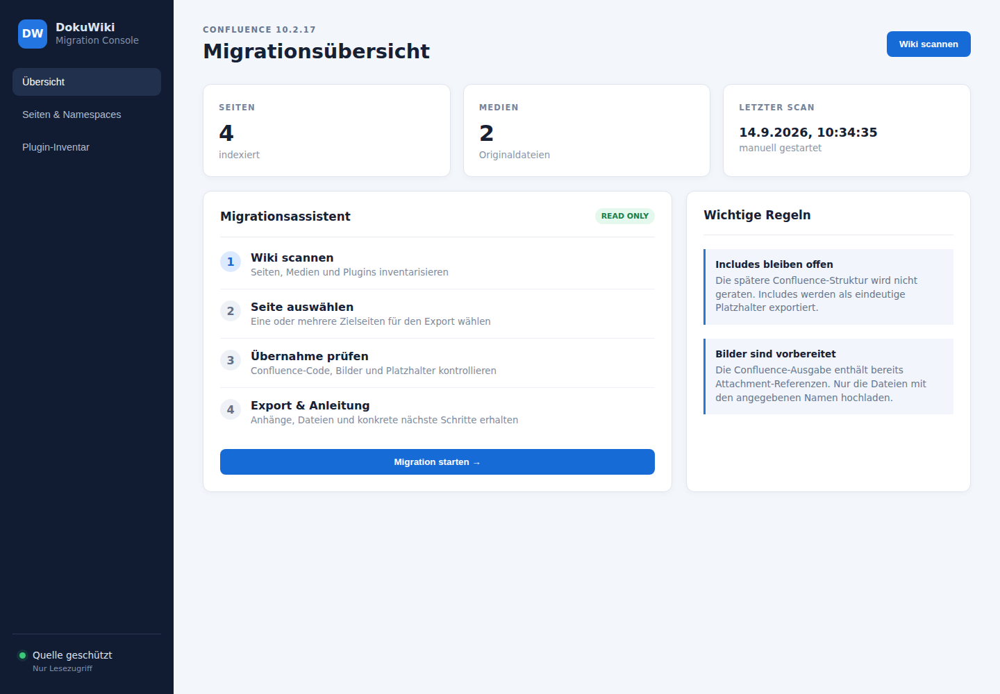
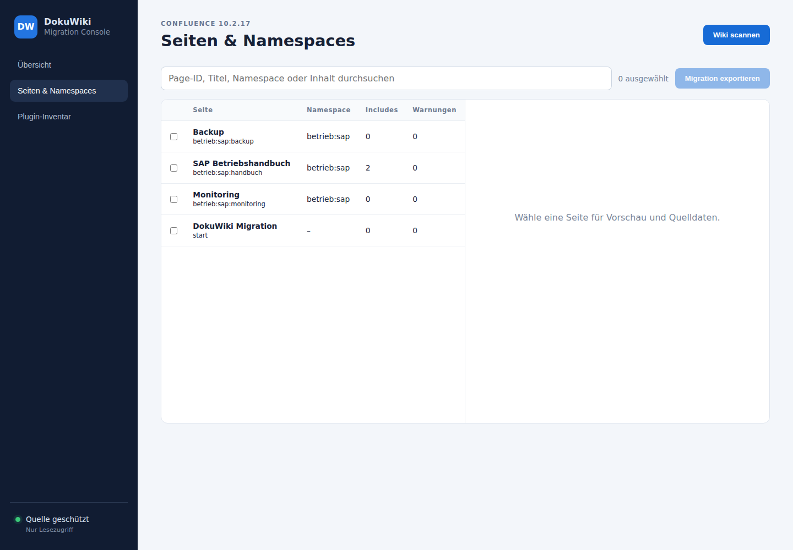
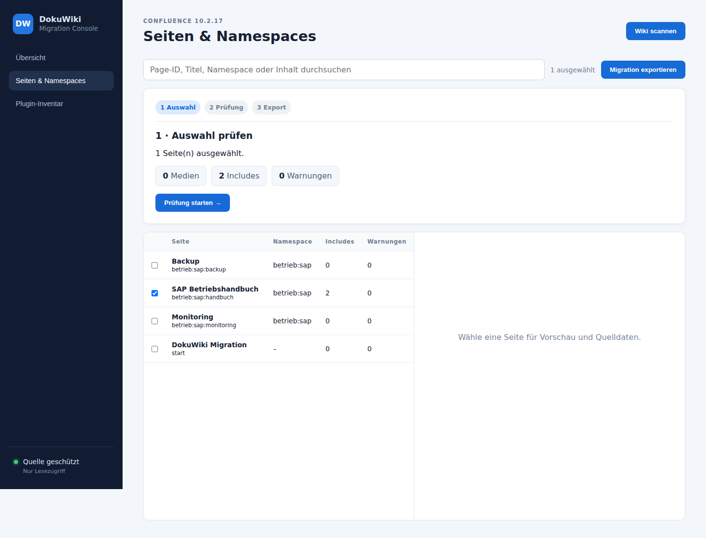
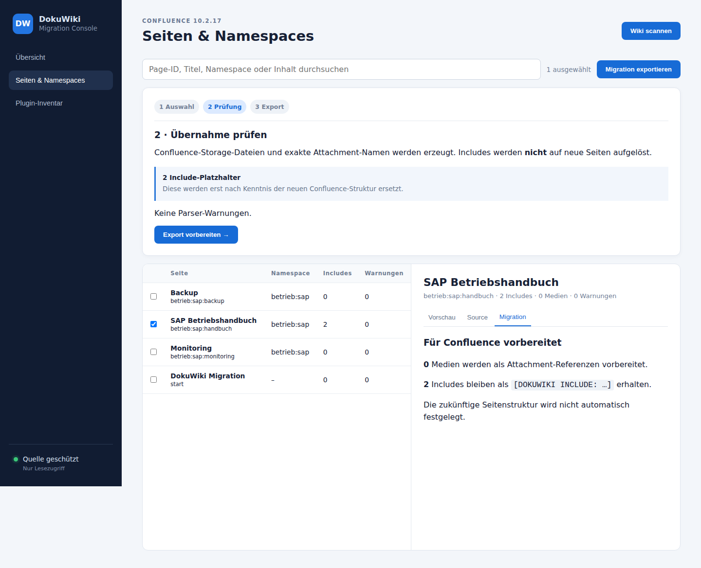
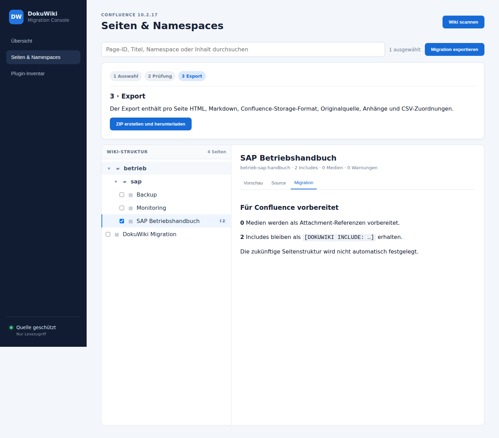
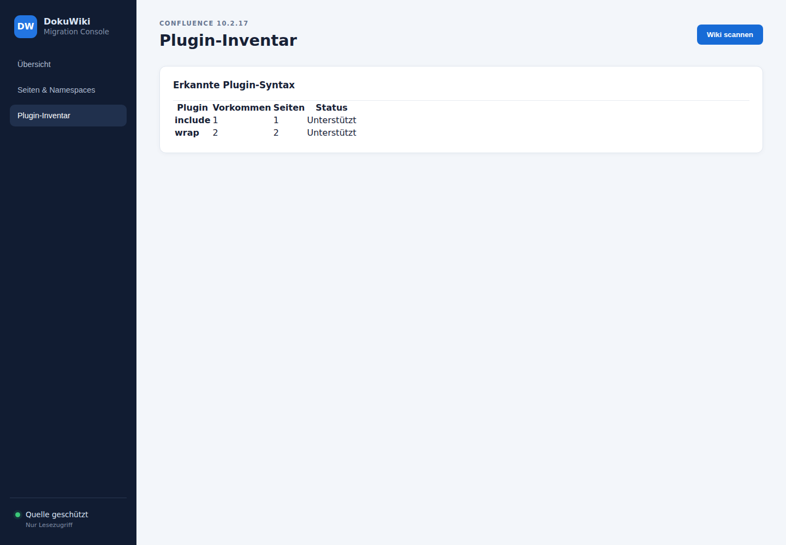

# Weboberfläche und automatische Dokumentations-Screenshots

Die Screenshots werden nicht manuell gepflegt. Der Workflow `UI Screenshots` baut die Anwendung, startet eine isolierte Testinstanz mit `testdata/dokuwiki`, führt einen read-only Scan aus und öffnet die Oberfläche in Headless Chromium.

Die Bilder bilden bewusst den **kompletten Benutzerablauf** ab und werden direkt aus der tatsächlich laufenden Anwendung erzeugt. Dadurch bleiben User-Guide und UI-Dokumentation synchron zur aktuellen Oberfläche.

## Screenshot-Satz

### 01 – Migrationsübersicht

Startpunkt des Migrationsprozesses. Die Ansicht zeigt Scan-Status, Seiten-/Medienbestand und die vier Schritte des Migrationsassistenten.

### 02 – Seiten und Namespaces

Zeigt Suche, Seitenliste, Namespaces sowie Includes und Warnungen pro Seite.

### 03 – Auswahl

Zeigt die explizite Seitenauswahl und die daraus berechnete Zusammenfassung.

### 04 – Migrationsprüfung

Zeigt die Migration-Ansicht einer ausgewählten Seite. Hier wird sichtbar, dass Medien als Attachment-Referenzen vorbereitet und Includes als Platzhalter behandelt werden.

### 05 – Export

Zeigt den letzten Schritt des Assistenten vor dem Erzeugen des ZIP-Exports.

### 06 – Plugin-Inventar

Zeigt die erkannten Plugins sowie deren Vorkommen und Unterstützungsstatus.

## Automatischer Ablauf

Der Screenshot-Test:

1. baut die aktuelle Binary,
2. startet eine isolierte Testinstanz,
3. führt einen Testscan aus,
4. öffnet die Oberfläche mit Chromium,
5. durchläuft die relevanten UI-Schritte,
6. prüft erwartete Seitentitel und UI-Zustände,
7. speichert sechs PNG-Dateien,
8. lädt die Bilder als Actions-Artefakt hoch und
9. aktualisiert die Bilder auf `main`, wenn sie sich geändert haben.

Bei einem Fehler wird zusätzlich `ui-failure.png` erstellt. Zusammen mit `server.log` und `scan.json` wird dies als Diagnose-Artefakt bereitgestellt.

Der Workflow benötigt `contents: write`, weil er die automatisch erzeugten Dokumentationsbilder direkt nach `main` zurückschreibt. Der Bot-Push löst keinen weiteren Screenshot-Lauf aus, sodass keine Endlosschleife entsteht.

## Ziel der Tests

Die Screenshots sind gleichzeitig eine leichte End-to-End-Prüfung der wichtigsten UI-Pfade. Sie ersetzen keine fachlichen Tests, stellen aber sicher, dass die dokumentierten Kernschritte weiterhin erreichbar und visuell nutzbar sind.
